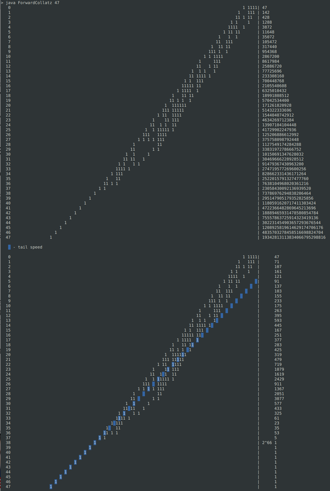
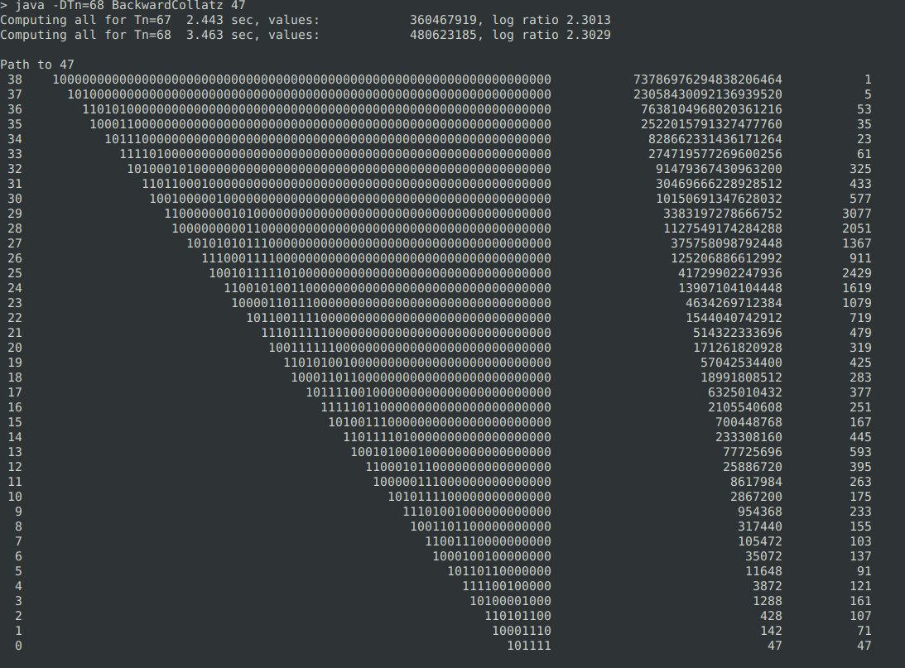

# 3n+1 problem proof and computer programs

## Proof

For details read [makarenko-alexandre-3n+1.pdf](makarenko-alexandre-3n%2B1.pdf)

### New/different formulation

> Change 1 - Instead of dividing even numbers by `2` we add `1` shifted left by the number of trailing zeros $T$.

> Change 2 - The sequence ends when it reaches $2^{T_n}$. In other words, eventually there will be only single `1` shifted left by the number of divisions by `2` we would accomplish with the regular Collatz algorithm.

Example for `11`:

|step|old decimal|old binary|new binary|new decimal|
|---:|------:|--------:|----------:|------:|
|   0| **11**|     1011|       1011| **11**|
|    |     *3|   100001|     100001|     *3|
|    |     +1|   100010|     100010|     +1|
|    |     /2|    10001|     100010|    nop|
|   1| **17**|    10001|     100010| **34**|
|    |     *3|   110011|    1100110|     *3|
|    |     +1|   110100|    1101000|     +2|
|    |     /4|     1101|    1101000|    nop|
|   2| **13**|     1101|    1101000|**104**|
|    |     *3|   100111|  100111000|     *3|
|    |     +1|   101000|  101000000|     +8|
|    |     /8|      101|  101000000|    nop|
|   3|  **5**|      101|  101000000|**320**|
|    |     *3|     1111| 1111000000|     *3|
|    |     +1|    10000|10000000000|    +64|
|    |    /16|        1|10000000000|    nop|
|   4|  **1**|        1|10000000000|**1024**|

Each new sequence value $X_{i+1}$ will be : $X_{i+1}=3X_i+2^{T_i}$ where $T_i$ is the number of trailing zeros in the value $X_i$.

### Reverse algorithm

Given a value $X_{i+1}$ we can find all $X_i$ with $X_i=(X_{i+1}-2^{T_i})/3$ by evaluating all $T_i$.

Example of all values reverted from $2^{10}$

|step 0|step 1|step 2|step 3|step 4|step 5|     binary|
|-----:|-----:|-----:|-----:|-----:|-----:|----------:|
|**1024**|    |      |      |      |      |10000000000|
|      |   341|      |      |      |      |  101010101|
|      |   340|      |      |      |      |  101010100|
|      |      |   113|      |      |      |    1110001|
|      |   336|      |      |      |      |  101010000|
|      |**320**|     |      |      |      |  101000000|
|      |      |   106|      |      |      |    1101010|
|      |      |      |    35|      |      |     100011|
|      |      |**104**|     |      |      |    1101000|
|      |      |      |**34**|      |      |     100010|
|      |      |      |      |**11**|      |       1011|
|      |      |    96|      |      |      |    1100000|
|      |   256|      |      |      |      |  100000000|
|      |      |    85|      |      |      |    1010101|
|      |      |    84|      |      |      |    1010100|
|      |      |    80|      |      |      |    1010000|
|      |      |      |    26|      |      |      11010|
|      |      |      |    24|      |      |      11000|
|      |      |    64|      |      |      |    1000000|
|      |      |      |    21|      |      |      10101|
|      |      |      |    20|      |      |      10100|
|      |      |      |      |     6|      |        110|
|      |      |      |    16|      |      |      10000|
|      |      |      |      |     5|      |        101|
|      |      |      |      |     4|      |        100|
|      |      |      |      |      |     1|          1|


The backward algorithm is combinatorial where the values reverted $2^{T_n}$ and $2^{T_n-1}$ never overlap.

> **Proof**.  By tending $T_n$ and $T_n-1$ to infinity the backward sequence will produce all integers.

## Code

In `src` all java files are standalone programs.
To compile for example ForwardCollatz.java:

```bash
$> javac ForwardCollatz.java
```

### Forward sequence

Example: solve Collatz in new formulation for 47:


### Backward sequence

Example: solve reverse Collatz for 47 starting from 2^68:



## Benchmarks

See in `bench` directory.
